# 🎨 Smart Segments for Krita

**AI-Powered Intelligent Segmentation Plugin**

[](https://opensource.org/licenses/MIT)
[](https://www.python.org/downloads/)
[](https://krita.org/)

Transform your digital art workflow with cutting-edge AI segmentation technology. Smart Segments leverages the power of SAM2 (Segment Anything Model 2) to provide intuitive, one-click object detection and selection in Krita.

---

## ✨ Features

- 🧠 **AI-Powered Segmentation** - Advanced machine learning for precise object detection
- 🎯 **Interactive Selection** - Click-to-select any object in your artwork
- ⚡ **Real-time Preview** - Instant visual feedback as you work
- 🔧 **Smart Tools Integration** - Seamless integration with Krita's native tools
- 🎨 **Artist-Friendly** - Designed by artists, for artists
- 🚀 **One-Click Setup** - Automated installation and configuration

## 📋 Prerequisites

| Requirement | Version | Notes |
|-------------|---------|-------|
| **Krita** | 5.0+ | APT version with Python support (not Snap) |
| **Python** | 3.7+ | System Python installation |
| **PyQt5** | Latest | For Python-Krita bindings |
| **Disk Space** | ~5GB | For AI models and dependencies |
| **RAM** | 4GB+ | Recommended for optimal performance |

### 🖥️ Platform Support

**Built and tested on Ubuntu 24.04 LTS**, with potential cross-platform compatibility for:
- 🐧 **Linux** (Ubuntu, Debian, Fedora, Arch)
- 🪟 **Windows** 10/11
- 🍎 **macOS** (experimental)

#### Ubuntu Development Dependencies
```bash
sudo apt install libgtk-4-dev libadwaita-1-dev git blueprint-compiler gettext libxml2-utils libgtk4-layer-shell-dev
```

> **Note**: While developed on Ubuntu, the plugin architecture supports cross-platform deployment. Windows and macOS compatibility may require additional testing.

## 🚀 Installation

### 🎯 Method 1: Import from GitHub (Recommended)

1. **Open Krita**
2. Navigate to **Tools** → **Scripts** → **Import Python Plugin from Web**
3. Enter this GitHub repository URL:
   ```
   https://github.com/a904guy/Smart_Segments
   ```
4. Click **OK** and wait for download to complete
5. **Restart Krita**
6. Go to **Settings** → **Configure Krita** → **Python Plugin Manager**
7. Enable **"Smart Segments"** plugin
8. **Restart Krita** again
9. Access via **Tools** → **Smart Segments**

### 📦 Method 2: Import from Release ZIP

1. **Download** the latest release ZIP from [GitHub Releases](https://github.com/a904guy/Smart_Segments/releases)
2. **Open Krita**
3. Navigate to **Tools** → **Scripts** → **Import Python Plugin from Zip File**
4. Select the downloaded ZIP file
5. **Restart Krita**
6. Go to **Settings** → **Configure Krita** → **Python Plugin Manager**
7. Enable **"Smart Segments"** plugin
8. **Restart Krita** again
9. Access via **Tools** → **Smart Segments**

### 🛠️ Method 3: Developer Installation

<details>
<summary>For developers and advanced users (click to expand)</summary>

This method creates symbolic links for live development:

```bash
./dev-install.sh
```

**What this does:**
- ✅ Verifies Krita installation and Python support
- ✅ Installs missing dependencies automatically
- ✅ Creates development symlinks for live editing
- ✅ Provides step-by-step activation guide

#### Manual Development Setup
```bash
# Create Krita plugin directory
mkdir -p ~/.local/share/krita/pykrita

# Create symbolic links for development
ln -sf "$(pwd)/smart_segments" ~/.local/share/krita/pykrita/smart_segments
ln -sf "$(pwd)/smart_segments.desktop" ~/.local/share/krita/pykrita/smart_segments.desktop
```

</details>

## 📸 Screenshots

See Smart Segments in action with these screenshots from the development process:

<div align="center">


</div>


## 👨‍💻 Development

> **Development Mode**: The plugin uses symbolic links, so code changes are immediately available after restarting Krita.

### Command Reference

| Command | Description | Alternative |
|---------|-------------|-------------|
| `./dev-install.sh` | Install plugin (dev mode) | - |
| `./dev-uninstall.sh` | Remove plugin | - |
| `./dev-utils.sh help` | Show all utilities | - |
| `./dev-utils.sh bundle` | Create distribution | `python3 create_plugin_package.py` |
| `./dev-utils.sh test` | Run test suite | `cd tests && python3 run_tests.py` |
| `./dev-utils.sh clean` | Clean artifacts | - |
| `./dev-utils.sh version` | Show version | - |

### 📂 Project Structure

```
📦 Smart Segments
├── 🎨 smart_segments/             # Main plugin source
├── 🧪 tests/                     # Test suite
├── 📚 documents/                 # Documentation
├── 🎁 resources/                 # Icons and assets
├── 🔧 dev-*.sh                   # Development scripts
└── 📋 create_plugin_package.py   # Distribution builder
```

## 📁 File Locations

| Component | Location | Type |
|-----------|----------|------|
| **Plugin Source** | `smart_segments/` | Directory |
| **Plugin Installation** | `~/.local/share/krita/pykrita/smart_segments` | Symlink |
| **Krita Logs** | `~/.local/share/krita/krita.log` | File |
| **Krita Config** | `~/.local/share/krita/` | Directory |

## 🚨 Troubleshooting

### 🔍 Plugin Not Appearing

<details>
<summary>Click for troubleshooting steps</summary>

1. **Verify Krita Version**
   ```bash
   which krita  # Should show: /usr/bin/krita
   ```

2. **Check Plugin Installation**
   ```bash
   ls -la ~/.local/share/krita/pykrita/
   ```

3. **Monitor Krita Logs**
   ```bash
   tail -f ~/.local/share/krita/krita.log
   ```

4. **Common Issues**
   - ❌ Using Snap version of Krita (doesn't support Python plugins)
   - ❌ Missing PyQt5 bindings
   - ❌ Plugin not enabled in Python Plugin Manager

</details>

### 📦 Snap Version Issue

If you have the Snap version of Krita, you'll need to switch to the APT version:

```bash
# Remove snap version
sudo snap remove krita

# Install APT version with Python support
sudo apt install krita python3-pyqt5
```

### 🔧 Diagnostic Commands

```bash
# System check
./dev-utils.sh version

# Plugin verification
ls -la ~/.local/share/krita/pykrita/smart_segments

# Real-time log monitoring
tail -f ~/.local/share/krita/krita.log
```

## 🔮 First Time Setup

When you first launch Smart Segments, the **Setup Wizard** automatically handles everything:

### 🎯 Automated Setup Process

```mermaid
graph LR
    A[Launch Plugin] --> B[System Check]
    B --> C[Create Virtual Env]
    C --> D[Download AI Models]
    D --> E[Install Dependencies]
    E --> F[Test Segmentation]
    F --> G[Ready to Use! 🎉]
```



| Step | Description | Time | Requirements |
|------|-------------|------|--------------|
| 1️⃣ | **System Requirements Check** | ~5s | - |
| 2️⃣ | **Virtual Environment Creation** | ~30s | Python 3.7+ |
| 3️⃣ | **AI Model Download (SAM2)** | ~5-10min | Internet connection |
| 4️⃣ | **Dependency Installation** | ~2-5min | Internet connection |
| 5️⃣ | **Test Segmentation** | ~30s | - |

> **📡 Internet Required**: First setup requires internet connection for downloading AI models (~2-3GB)

## 🔧 System Requirements

### 💾 Dependencies (Auto-installed)
- **PyTorch** - Deep learning framework
- **SAM2 Models** - AI segmentation models  
- **NumPy** - Numerical computing
- **OpenCV** - Computer vision utilities
- **Pillow** - Image processing

### 💿 Storage Requirements
- **Base Plugin**: ~50MB
- **AI Models**: ~2-3GB  
- **Dependencies**: ~1-2GB
- **Total**: ~5GB

---

## 🤝 Contributing

We welcome contributions! See our [contributing guidelines](CONTRIBUTING.md) for details.

## 📄 License

This project is licensed under the MIT License - see the [LICENSE](LICENSE) file for details.

## 🙏 Acknowledgments

- **Krita Foundation** - For the amazing open-source digital painting software
- **Meta AI** - For the incredible SAM2 model
- **PyTorch Team** - For the powerful deep learning framework

---

<div align="center">

**Made with ❤️ by [Hawkins.Tech Inc](https://github.com/a904guy/Smart_Segments)**

[🐛 Report Bug](https://github.com/a904guy/Smart_Segments/issues) • [✨ Request Feature](https://github.com/a904guy/Smart_Segments/issues) • [📖 Documentation](https://github.com/a904guy/Smart_Segments)

</div>
